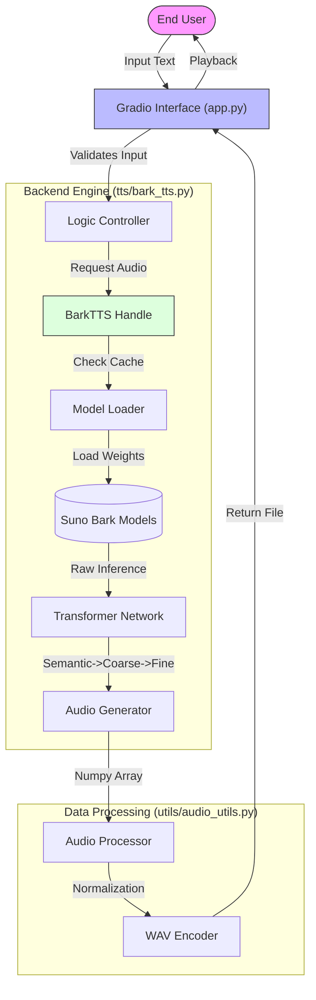

# 🌍 Universal Multilingual Text-to-Speech (Offline)


> **"Bridging Linguistic Gaps with Offline AI Voice Synthesis."**

**Principal Author & Architect**: **Mausam Kar**

---

## 📑 Table of Contents

1. [Executive Summary](#-executive-summary)
2. [Technical Architecture](#-technical-architecture)
3. [Module Breakdown](#-module-breakdown)
4. [Technology Stack Deep Dive](#-technology-stack-deep-dive)
5. [Installation & Setup](#-installation--setup)
6. [User Manual](#-user-manual)
7. [System Requirements](#-system-requirements)
8. [Troubleshooting & Limitations](#-troubleshooting--limitations)
9. [License](#-license)

---

## 📖 Executive Summary

**Universal Multilingual Text-to-Speech** is a production-grade, locally hosted application designed to democratize access to high-quality speech synthesis. Unlike conventional TTS systems that sound robotic or require cloud dependencies, this solution leverages Generative AI to understand context, emotion, and language nuances.

Developed by **Mausam Kar**, this project emphasizes **privacy**, **accessibility**, and **performance**, running entirely offline on consumer-grade hardware while supporting seamless switching between languages like English, Hindi, and Spanish.

---

## 🏗 Technical Architecture

The system follows a modular **Model-View-Controller (MVC)**-like pattern, separating the User Interface, the Logic Controller, and the Data/Model layer.

### 🧩 System Flowchart



---

## � Module Breakdown

The project is structured to enforce separation of concerns and maintainability. Here is a detailed explanation of each file and module:

### 1. `app.py` - The Application Entry Point

- **Role**: Acts as the **View** and **Controller**. It initializes the web server and manages user interaction.
- **Key Functions**:
  - Setup of the **Gradio** Blocks interface.
  - Handling user events (Button clicks).
  - Error propagation to the frontend.
  - Calling the backend logic.

### 2. `tts/bark_tts.py` - The Core Engine

- **Role**: Encapsulates the **Suno Bark** model logic. This is the "Brain" of the operation.
- **Key Responsibilities**:
  - **Model Management**: Handles the downloading and caching of neural network weights (`text`, `coarse`, `fine`).
  - **Memory Optimization**: Manages the `SUNO_USE_SMALL_MODELS` environment variable to prevent Out-Of-Memory (OOM) errors.
  - **Safety Patching**: Implements a monkeypatch for `torch.load` to ensure compatibility with newer PyTorch security features (`weights_only=True`).
  - **Inference**: Runs the `generate_audio` function to convert text tokens into audio waveforms.

### 3. `utils/audio_utils.py` - Utilities

- **Role**: Helper functions for file I/O.
- **Key Functions**:
  - `save_audio`: robustly handles the conversion of raw NumPy arrays (float32) into standard WAV files (PCM 16-bit or similar) using `soundfile`.
  - Directory management (ensuring output folders exist).

---

## � Technology Stack Deep Dive

We carefully selected specific libraries to ensure robustness and performance.

| Library       | Version     | Role & Justification                                                                                                                                               |
| :------------ | :---------- | :----------------------------------------------------------------------------------------------------------------------------------------------------------------- |
| **Python**    | 3.10+       | **Runtime Environment**. Chosen for its rich ecosystem of AI/ML libraries.                                                                                         |
| **Suno Bark** | `bark`      | **Generative Model**. A transformer-based text-to-audio model capable of generating highly realistic, multilingual speech and non-speech sounds (laughter, sighs). |
| **PyTorch**   | `torch`     | **Tensor Computation**. The backbone deep learning framework used to run the Bark neural network operations on CPU/GPU.                                            |
| **Gradio**    | `gradio`    | **User Interface**. Provides a clean, modern web-based UI with minimal code, allowing for rapid prototyping and easy sharing.                                      |
| **SoundFile** | `soundfile` | **Audio I/O**. A high-performance library based on `libsndfile` for reading and writing audio files.                                                               |
| **NumPy**     | `numpy`     | **Data Structure**. Handles the heavy matrix manipulations required for audio signal processing.                                                                   |

---

## 📥 Installation & Setup

### Prerequisites

- OS: Windows 10/11, macOS, or Linux.
- RAM: Minimum 8GB (16GB recommended).
- Internet: Required for initial setup and model download (~2GB).

### Step 1: Clone the Repository

```bash
git clone https://github.com/mausam-kar/Universal-Multilingual-TTS.git
cd Universal-Multilingual-TTS
```

### Step 2: Environment Setup

We use `venv` to create an isolated environment.

```bash
# Windows
python -m venv venv
venv\Scripts\activate

# Linux / Mac
python3 -m venv venv
source venv/bin/activate
```

### Step 3: dependency Installation

```bash
pip install -r requirements.txt
```

---

## 🎮 User Manual

1.  **Launch the System**:
    ```bash
    python app.py
    ```
2.  **Access the GUI**:
    Open your browser to `http://127.0.0.1:7860`.
3.  **Operation**:
    - **Input Box**: Type your text. Bark detects language automatically.
      - _Hint_: Use "[laughter]" or "[sighs]" to add expressions (English only).
    - **Generate**: Click the button.
    - **Wait**: Processing time depends on CPU speed (approx 10-30s for short sentences).
    - **Output**: Play the audio directly or download it.

---

## ⚠️ Troubleshooting & Limitations

| Symptom                        | Probable Cause   | Solution                                                                                      |
| :----------------------------- | :--------------- | :-------------------------------------------------------------------------------------------- |
| **"Weights only load failed"** | PyTorch Security | We have patched this in `bark_tts.py`. Ensure you are running the latest version of our code. |
| **App Crashes (OOM)**          | Low RAM          | The app defaults to "Small" models. Ensure no other heavy apps are running.                   |
| **Slow Performance**           | Running on CPU   | Transformer models are heavy. For speed, an NVIDIA GPU with CUDA is recommended.              |
| **Hallucinations**             | Very Long Text   | Bark works best with short-to-medium sentences. Split long paragraphs into smaller chunks.    |

---

## 📜 License

This project is open-sourced under the **MIT License**. You are free to view, modify, and distribute the code for personal or commercial use.

---

<div align="center">

**Designed & Developed by Mausam Kar**
_Empowering creativity through open-source AI._

</div>
