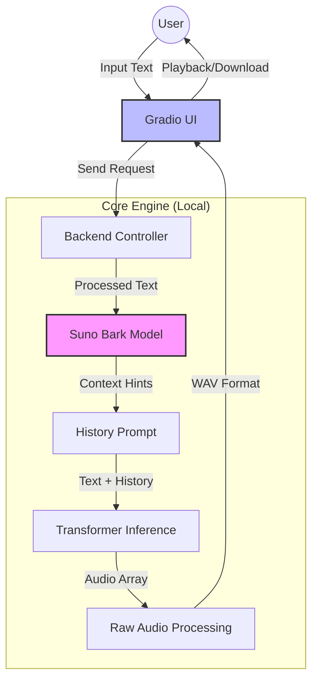

# 🌍 Universal Multilingual Text-to-Speech (Offline)


> **"Turning Text into Lifelike Speech, Anywhere, Anytime."**

**Author**: **Mausam Kar**

---

## 📑 Table of Contents

1. [Project Overview](#-project-overview)
2. [Key Features](#-key-features)
3. [System Architecture](#-system-architecture)
4. [Technology Stack](#-technology-stack)
5. [Installation Guide](#-installation-guide)
6. [Usage Instructions](#-usage-instructions)
7. [Troubleshooting](#-troubleshooting)
8. [License](#-license)

---

## 📖 Project Overview

**Universal Multilingual Text-to-Speech** is a state-of-the-art, locally hosted application designed to generate human-quality speech from text. Unlike cloud-based solutions that require expensive API keys and internet connectivity, this project runs **entirely offline** on your personal computer.

Leveraging the power of **Suno Bark**, a transformer-based generative audio model, it creates highly realistic speech, including non-verbal cues like laughter, hesitation, and breathing, across multiple languages.

---

## 🚀 Key Features

| Feature                     | Description                                                                                            | Status       |
| :-------------------------- | :----------------------------------------------------------------------------------------------------- | :----------- |
| **🌐 Multilingual Support** | Automatically handles input in **English, Hindi, Spanish, French**, and more without manual switching. | ✅ **Ready** |
| **🔒 100% Offline**         | Runs locally. Your data never leaves your machine. Perfect for privacy-conscious users.                | ✅ **Ready** |
| **💸 Completely Free**      | No subscriptions, no credits, no API limits. Built on open-source technology.                          | ✅ **Ready** |
| **🧠 Smart Context**        | Understands code-switching (e.g., Hinglish) and emotional tone automatically.                          | ✅ **Ready** |
| **⚡ Optimized**            | Configured to run on standard consumer hardware (CPU or GPU).                                          | ✅ **Ready** |

---

## 🏗 System Architecture

The following diagram illustrates how the application processes your text and converts it into audio.



### 🔄 Data Flow

1.  **Input**: User types text into the Gradio web interface.
2.  **Processing**: The application validates input and selects the appropriate model configuration.
3.  **Inference**:
    - **Text Processing**: Text is tokenized.
    - **Semantic Generation**: The model predicts semantic tokens.
    - **Acoustic Generation**: Semantic tokens are converted to audio waveforms.
4.  **Output**: The raw numpy array is converted to a standard WAV file and sent back to the browser.

---

## 🛠 Technology Stack

This project is built using robust, industry-standard open-source libraries.

| Component     | Technology                                                                        | Purpose                            |
| :------------ | :-------------------------------------------------------------------------------- | :--------------------------------- |
| **Language**  |  | Core programming logic.            |
| **AI Model**  | **Suno Bark**                                                                     | Generative text-to-audio engine.   |
| **Framework** | **PyTorch**                                                                       | Deep learning tensor computations. |
| **Interface** | **Gradio**                                                                        | Web-based user interface.          |
| **Audio**     | **SoundFile / SciPy**                                                             | Audio file processing and saving.  |

---

## 📥 Installation Guide

Follow these steps to set up the project on your local machine.

### Prerequisites

- **Python 3.10+** installed.
- **Git** (optional, for cloning).
- **8GB+ RAM** (Recommended).

### Step-by-Step Setup

1.  **Clone the Repository**

    ```bash
    git clone https://github.com/your-repo/Universal-Multilingual-TTS.git
    cd Universal-Multilingual-TTS
    ```

2.  **Create Virtual Environment**
    Isolate dependencies to avoid conflicts.

    ```bash
    # Windows
    python -m venv venv
    venv\Scripts\activate

    # Linux / macOS
    python3 -m venv venv
    source venv/bin/activate
    ```

3.  **Install Dependencies**
    ```bash
    pip install -r requirements.txt
    ```

---

## 🎮 Usage Instructions

1.  **Start the Application**
    Run the following command in your terminal:

    ```bash
    python app.py
    ```

2.  **Access the Interface**
    Open your browser and navigate to:
    👉 **[http://127.0.0.1:7860](http://127.0.0.1:7860)**

3.  **Generate Speech**
    - **Input**: "नमस्ते दोस्तो, आप कैसे हैं?" (Hindi) or "Hello friends, how are you?" (English).
    - **Action**: Click the **Generate Speech** button.
    - **Result**: Listen to the generated audio or download the `.wav` file.

---

## ❓ Troubleshooting

| Issue               | Possible Cause   | Solution                                                                                               |
| :------------------ | :--------------- | :----------------------------------------------------------------------------------------------------- |
| **Slow Generation** | CPU usage        | Inference on CPU is slower than GPU. Be patient, or use a machine with an NVIDIA GPU (CUDA).           |
| **Long First Run**  | Model Download   | The app downloads ~2GB of models on the first run. Ensure you have a stable internet connection.       |
| **Out of Memory**   | Large Models     | By default, this app uses `small` models to prevent crashes. Close other background apps.              |
| **PyTorch Errors**  | Version mismatch | Ensure you installed requirements exactly as specified. We include a patch for newer PyTorch versions. |

---

## 📜 License

This project is open-source and available under the **MIT License**.

---

<p align="center">
  Built with ❤️ by <b>Mausam Kar</b>
</p>
